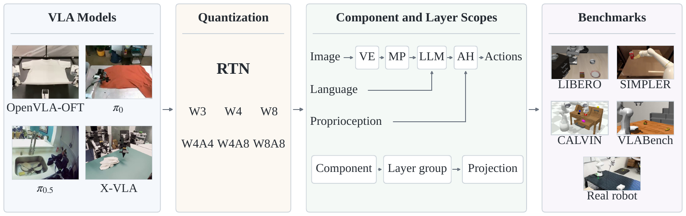
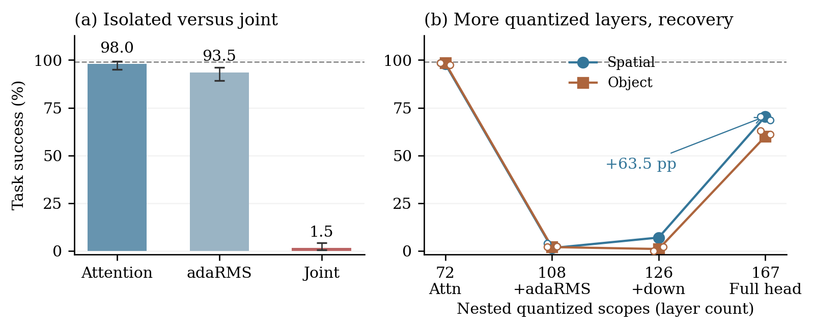
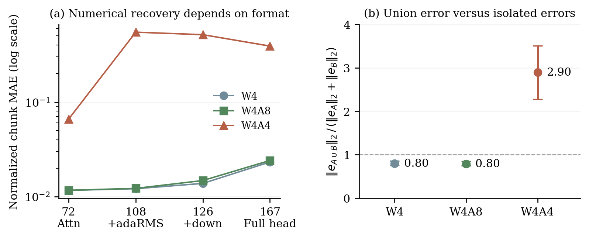

# VLAQuantBench

**Closed-loop evaluation of post-training quantization for vision–language–action models.**

[Jiuyi Xu](https://jiuyixu25.github.io/), Qing Jin, Meida Chen, Song Wang, Yang Sui, Yangming Shi

[](#citation)
[](LICENSE)

<p align="center"></p>

Quantization decisions for VLA policies are usually made with proxy signals — action
error against the full-precision policy, or calibration-time activation statistics.
VLAQuantBench measures the thing that actually matters instead: **task success when the
quantized policy is rolled out in the simulator under the benchmark's own protocol**, and it
tests quantized layer groups both in isolation and jointly, because the two do not agree.

Every number in the paper is reproducible from this repository. The per-episode records of
all 417 evaluation cells (105,868 closed-loop episodes) are included, together with the
summaries of the same-observation replay study. The paper analyzes 409 of these runs
(94,574 episodes): everything except the seven SIMPLER variant-aggregation runs, whose
per-variant coverage is unequal, and one superseded exclusion trial
(`ablate-W3-e2e-no_any_fc2`). Cells include baselines and evaluation-seed repetitions, so the
count is not a count of distinct precision assignments. Every table is regenerated from the
records by a script — nothing is transcribed by hand — and
[`docs/paper_map.md`](docs/paper_map.md) lists, for every table and figure of the paper, the
result files and the script behind it.

```bash
vqb run --model pi05 --benchmark libero --suite libero_spatial --preset W4A4 --scope ah
vqb summarize results/ --ci
python scripts/verify_cells.py            # independent audit of every shipped cell
```

## What it measures

| | |
|---|---|
| **Models** | OpenVLA-OFT, π0, π0.5, X-VLA (plus adapters for OpenVLA, CogACT, InternVLA-M1) |
| **Benchmarks** | LIBERO (4 suites), SIMPLER (visual matching + variant aggregation), CALVIN ABC→D, VLABench (5 tracks) |
| **Formats** | W2/W3/W4/W8 weight-only; W4A4, W4A6, W4A8, W8A8 with activations; per-group / per-channel, symmetric / asymmetric |
| **Scopes** | end-to-end · one component (VE / MP / LLM / AH) · a layer group · a single named layer |
| **Methods** | RTN anchor, plus AWQ, NF4, LLM.int8(), SmoothQuant on the LLM backbone, in both fake-quant and real-kernel paths |
| **Scale** | 417 shipped cells / 105,868 closed-loop episodes (`results/summary.csv`); the paper analyzes 409 runs / 94,574 episodes. 200 episodes per LIBERO cell with 95% Wilson intervals (X-VLA 190); budgets and native metrics differ per benchmark (five VLABench W4A4 tracks at a documented reduced budget) |

## Main findings (all regenerated from the shipped records)

<p align="center"></p>

1. **Isolated sensitivity is not compositional.** On π0.5's action head at W4A4, attention
   alone costs 1.0 percentage points and the adaRMS modulators alone 5.5, but their 108-layer
   union costs 97.5 (LIBERO-Spatial, baseline 99.0%; repeated on Object at three seeds).
   X-VLA's two MLP projection groups lose 30.5 and 2.6 points separately and 72.6 jointly.
2. **Under uncalibrated W4A4 RTN, quantizing more layers can improve success.** Expanding the
   π0.5 subset from 126 to 167 layers raises success from 7.0% to 70.5%. Same-observation,
   same-noise replay of 20 held-out trajectories shows the larger subset also has lower
   action-chunk error on 217 of 219 chunks, so this is not a success-threshold artifact. The
   recovery is carried by five small conditioning and projection layers (5.3M parameters:
   126 + those five = 78.5%), not by the 36 gate/up projections (26.5%). It is absent at W4
   and W4A8 (all six settings within 1.5 points of baseline) and disappears under two-episode
   action-head calibration (union 97.5%, 126-layer subset 99.0%).
3. **One 28,672-parameter projection carries OpenVLA-OFT's failures.** Quantizing only its
   final action projection fc2 at W4A8 gives 18.0% while the 33.6M-parameter residual group
   gives 99.5%, although their activation kurtosis is 834.3 versus 835.3. Keeping fc2 at
   released precision while the other 441 eligible layers are quantized restores the W3
   LIBERO-Long collapse (8.0% → 93.5/91.5/91.0% over three seeds) and every 8-bit-activation
   collapse on the four suites (W4A8: 21.5/2.5/2.0/76.0% → 97.5/97.0/98.0/94.0%).
4. **Calibration is part of the precision assignment.** The same two-episode SmoothQuant-style
   recipe recovers π0.5 (end-to-end W4A4 0% → 91.5% at α=0.75; action head 70.5% → 98.5%),
   lowers π0 at every scope (end-to-end 61.0% → 10.5%), and only partially recovers OFT
   (LLM 0% → 33.0%, action head 0% → 38.5%, end-to-end 0% → 9.5%). Folding the smoothing
   vector into 4-bit weights doubles π0's weight quantization error; it barely changes π0.5's.
5. **Proxies need closed-loop validation.** On one held-out OFT trajectory AWQ has 1.44× lower
   action MAE than RTN at W4 (1.15× at W3) while near-ceiling task success cannot resolve a
   difference; task-clustered bootstrap intervals (`scripts/clustered_table.py`) show which
   headline contrasts survive task-level clustering and which (π0 Spatial W4) do not.

<p align="center"></p>

The replay figure is the control behind findings 1 and 2: with identical observations and
identical flow-matching noise, the 126-to-167-layer error reversal and the super-additive union
error appear only at W4A4 (norm ratio 2.90 versus 0.80 at W4 and W4A8).

## Install

The four VLAs and four simulators have mutually incompatible dependency stacks, so the
core package is installed **into each model's own environment** rather than the other way
round. `scripts/env/` pins the upstream commit for each stack.

```bash
git clone https://github.com/jiuyixu25/VLAQuantBench && cd VLAQuantBench
bash scripts/env/setup_pi05.sh        # creates the env, clones upstream, installs this package
pip install -e .                      # or install into an environment you already have
```

Pin `mujoco==3.3.2` for OpenVLA-OFT and the π models. Versions ≥3.4.0 change box–box
collision resolution so that one LIBERO-Spatial task's stored initial state no longer settles
into its intended configuration — the failure is invisible in aggregate and costs 3–9 suite
points. The X-VLA environment pins MuJoCo 3.1.6, which predates the change; the version used
is recorded in every `diagnostics/v2/*.json`. See [`docs/protocol.md`](docs/protocol.md).

## Reproducing a table

```bash
python scripts/verify_cells.py                 # recompute every cell from its records;
                                               # rejects any cell whose recorded quantized-layer
                                               # count disagrees with its declared scope
python scripts/ablation_tables.py              # within-component decomposition
python scripts/precision_budget.py             # per-component activation-bit budgets
python scripts/diag_vs_damage.py               # activation statistics vs. measured damage
python scripts/profile_kernels.py              # real-kernel latency and memory
python scripts/action_fidelity.py record ...   # paired-observation action fidelity: record one
python scripts/action_fidelity.py replay ...   #   full-precision episode, replay it quantized
python scripts/replay_pi05_subsets.py record   # same-observation, same-noise replay of action-head
python scripts/replay_pi05_subsets.py replay   #   subsets (20 held-out π0.5 trajectories): record,
python scripts/replay_pi05_subsets.py analyze  #   replay each configuration, compose the statistics
python scripts/replay_table.py                 # replay summary table from analysis.json
python scripts/clustered_table.py              # task-clustered bootstrap intervals for the headline contrasts
python scripts/calib_scope_table.py            # three-model calibration-by-scope table
python scripts/make_summary.py                 # regenerate results/summary.csv from the records
```

Activation calibration (`vqb run --act-calib ...`) collects its statistics on init states
starting at 20 by default (`--act-calib-from`), disjoint from the evaluation states 0–19; the
cells collected in August 2026 used `--act-calib-from 0`, and the three-set replication in
`results/libero/libero_spatial/pi05/calib_set*` shows the choice does not change the outcome.
The September 2026 calibration cells (`calib_*` for π0.5, π0 and OpenVLA-OFT) use init states
20–21. Every run header records the calibration components, episode range, seed, smoothing
strength, clip quantile, cache tag, and code revision, and the statistics cache is keyed on all
of them.

## Results layout

```
results/<benchmark>/<suite>/<model>/<method>-<PRESET>-<scope>.jsonl
```

Line 1 is a run header: model, checkpoint, preset, scope, method, the per-component
quantization report (layers and parameters actually quantized), seed, git commit, host,
GPU. Every following line is one episode: task, episode index, seed, success, steps, wall
time, per-benchmark scalar (CALVIN subtasks, VLABench progress), policy and inference
latency, peak VRAM. Runs are resumable and a header mismatch is refused.
`results/summary.csv` carries one row per cell with its Wilson interval
(`scripts/make_summary.py`). Real-kernel profiling runs (`results/latency/`), the
paired-observation fidelity test (`results/fidelity/`), the replay-study summaries
(`results/replay/`), and the activation diagnostics with full provenance (`diagnostics/v2/`)
are described in [`results/README.md`](results/README.md).

## Evaluation-stack pitfalls

Three defects we hit while building this each moved measured success by more than a
typical method delta, and each is invisible without per-task auditing:

* **Simulator physics version** — see the MuJoCo pin above.
* **Action-chunk execution length** — a released π-family config executes 50-step chunks
  open-loop where the protocol replans every 10; the policy looks healthy and loses 10–25
  points.
* **Incomplete activation hooks** — hooks that silently miss the action head report
  weight-only behaviour for it. Because OFT's activation failure lives in one layer, a
  2–36% outcome becomes a healthy-looking 94–96%.

Hook coverage is enforced in code: `quantize_modules` installs the activation hook on every
layer it quantizes, the run header records the per-component layer counts, and results from
the pre-fix code path are not shipped. `scripts/verify_cells.py` recomputes every cell from its
episode records and rejects any cell whose recorded quantized-layer count disagrees with its
declared scope. It caught a real silent failure during this study: a pattern-mismatch ablation
that had quantized nothing and re-measured the baseline.

## Adding your own

* A model: [`docs/adding_a_model.md`](docs/adding_a_model.md) — implement `load`,
  `component_map`, `reset`, `act`.
* A benchmark: [`docs/adding_a_benchmark.md`](docs/adding_a_benchmark.md) — implement
  `tasks`, `run_episode`, and the official metric.
* A quantizer: apply it in place, then run any scope; the harness records what was
  actually quantized.

## Citation

```bibtex
@misc{xu2026vlaquantbench,
  title  = {VLAQuantBench: Closed-Loop Evaluation of Post-Training Quantization for Vision-Language-Action Models},
  author = {Xu, Jiuyi and Jin, Qing and Chen, Meida and Wang, Song and Sui, Yang and Shi, Yangming},
  year   = {2026},
  note   = {arXiv preprint}
}
```

See also [`CITATION.cff`](CITATION.cff). Released under the [MIT License](LICENSE).
